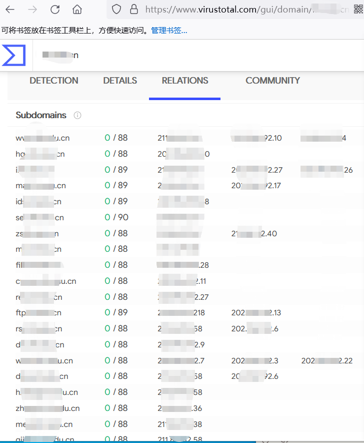
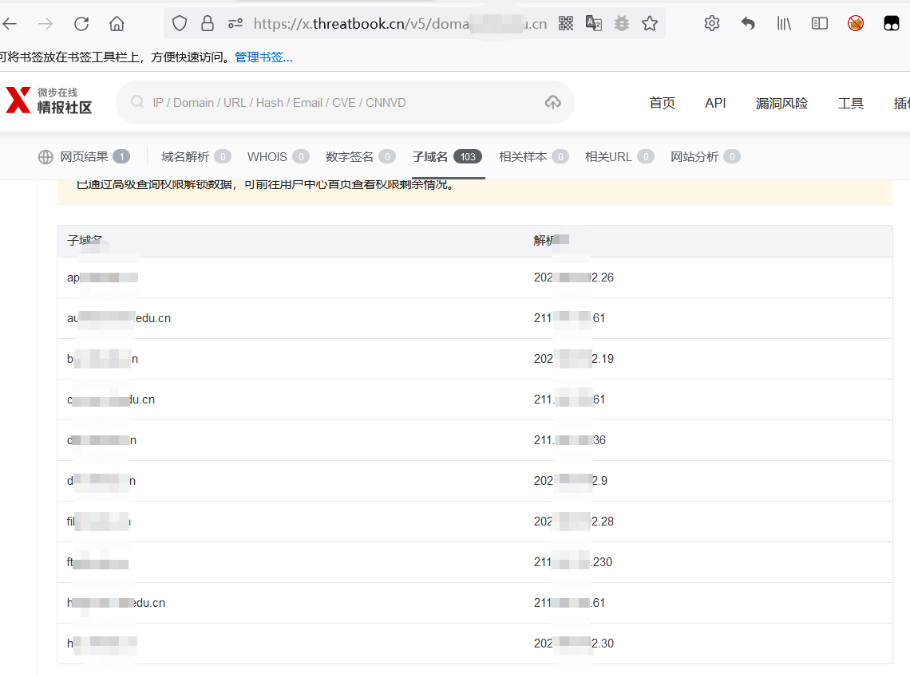
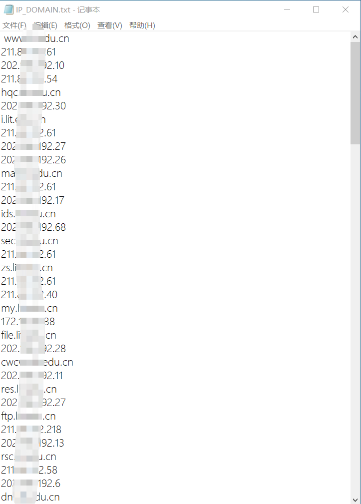
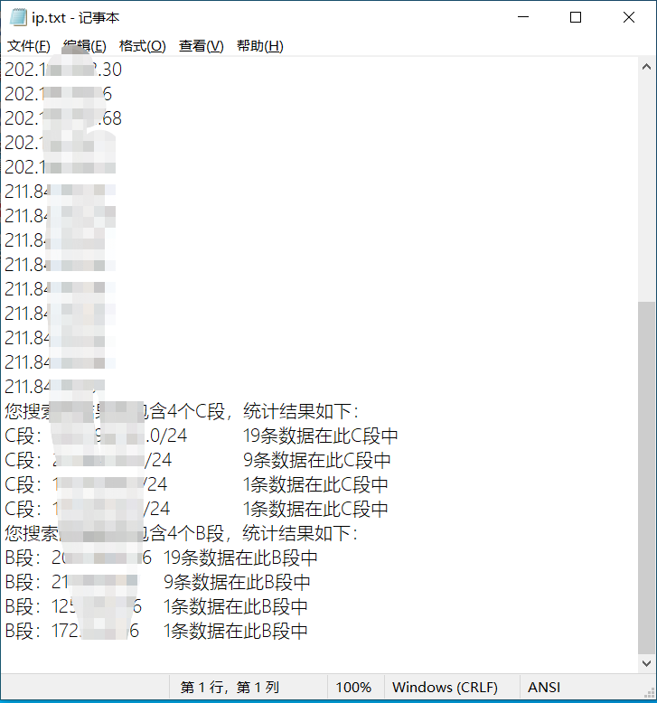
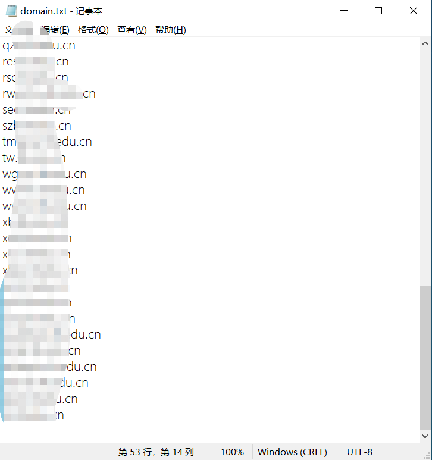

# IP_DOMAIN_TOOL
## IP_域名整理工具 by 白泽Sec-ahui

联系方式：aaaahuia@163.com

### 工具简述：

用于整理零乱的域名和IP列表，适用于从各种网站上粘下来的域名IP列表

### 使用方法：

##### 使用环境：python2

从vt，微步，火线等网站复制IP和域名列表，全都粘贴到一个txt文件中即可。






粘贴到IP_DOMAIN.txt后如下图所示：



##### 参数：

```
-f,--file           指定要处理的文件名，例如：-f C:\IP_DOMAIN.txt
```

Example Usages：

```
python2 IP_DOMAIN_TOOL.py -f C:\IP_DOMAIN.txt
```

会生成两个文件，ip.txt和domain.txt





